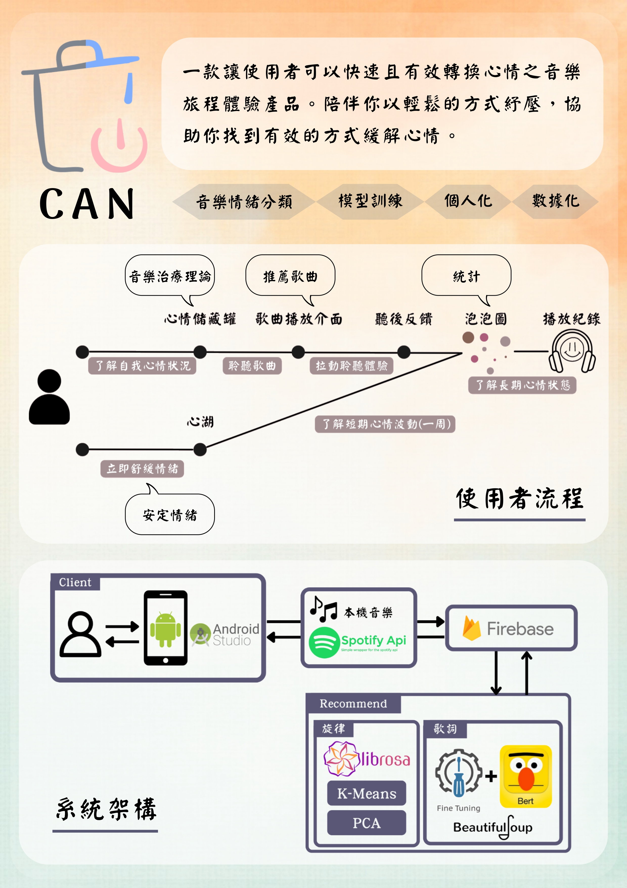

# [CAN](https://youtu.be/AdOh6mfwlug)
- Building an application cooperating the topics of music and emotion
- We facilitate the user experience of services for 89% of listeners on the online streaming platform by connecting music with people's emotions.
- Applying skills such as fine-tuning BERT model, Beautifulsoup, Librosa, K-means Clustering, and front-end development

